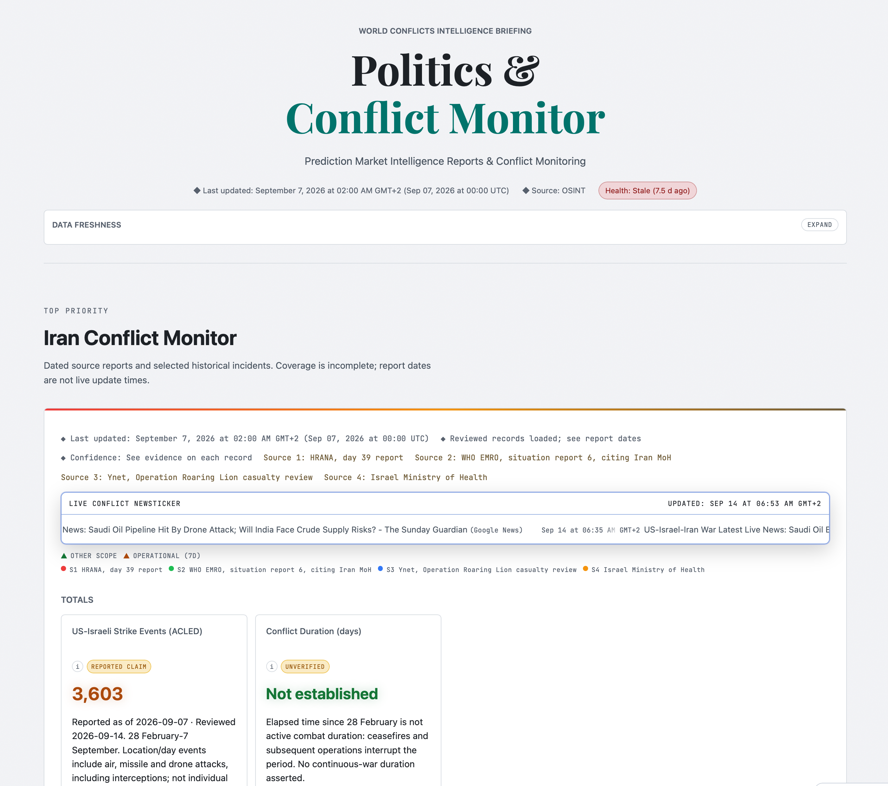
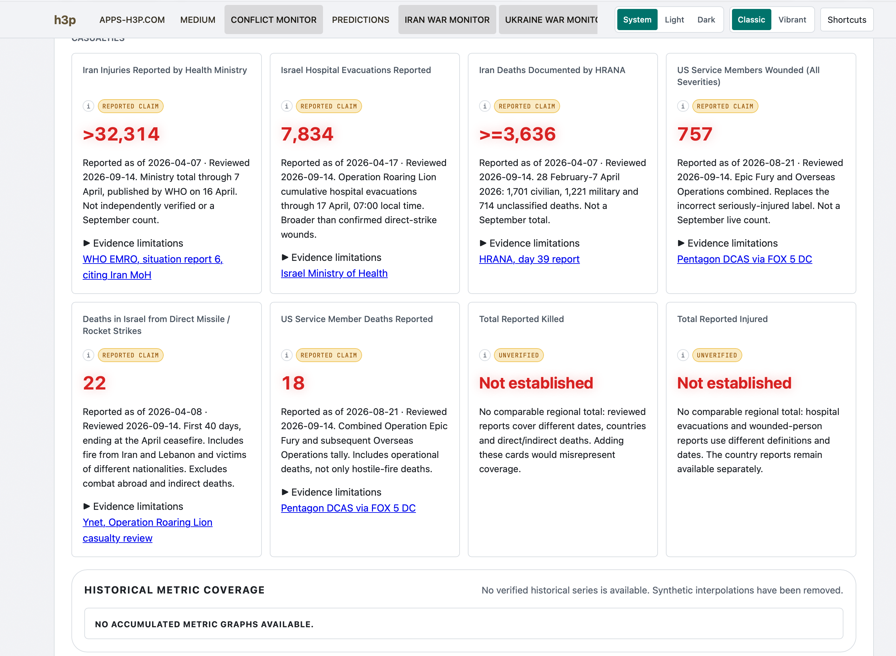

<p align="center">
  <a href="https://apps-h3p.com"></a>
  <a href="https://www.patreon.com/h3p"></a>
  <a href="https://www.paypal.com/paypalme/HilthartPedersen"></a>
</p>

<p align="center">
  <a href="https://github.com/h3pdesign/appsh3p/commits/main"></a>
  <a href="https://apps-h3p.com"></a>
  <a href="https://apps-h3p.com/polymarket-us-politics/conflict-monitor.html"></a>
  <a href="https://apps-h3p.com"></a>
  <a href="https://vitepress.dev/"></a>
</p>

<h1 align="center">h3p apps &amp; Politics and Conflict Monitor</h1>

<p align="center">
  <strong>Native app documentation, dated conflict reports, and prediction-market coverage.</strong><br>
  One repository for the h3p apps hub and the public Politics &amp; Conflict Monitor.
</p>

<p align="center">
  <a href="https://apps-h3p.com">apps-h3p.com</a> ·
  <a href="https://apps-h3p.com/polymarket-us-politics/conflict-monitor.html">Conflict Monitor</a> ·
  <a href="https://apps-h3p.com/polymarket-us-politics/state-of-us-politics.html">Predictions</a> ·
  <a href="https://apps-h3p.com/support">Support</a> ·
  <a href="https://apps-h3p.com/policies/privacy-policy">Policies</a>
</p>

---

## Overview

This repository publishes two related public surfaces from one deployable codebase.

### H3P Apps Documentation Hub

The apps hub at [apps-h3p.com](https://apps-h3p.com) is the canonical documentation and release-communication layer for current H3P apps.

It provides:

- app overview pages with platform support and status metadata
- installation, feature, FAQ, changelog, and component documentation
- support, legal, privacy, cookie-policy, and trust pages
- app-specific icons, media, screenshots, and release-linked content
- shared navigation, app-page styling, and footer across the documentation

The catalogue covers ten apps: Neon Vision Editor, GitBird, Liquid Record, Metrics Data, X-Newsbook, Release Assistant, Image Sorter, Vistral, History Vision, and Lingua Latina. Availability and platform support are documented per app.

### Politics & Conflict Monitor

The monitor surface combines conflict-monitoring presentation and prediction-market reporting.

Primary entry points:

- [Conflict Monitor](https://apps-h3p.com/polymarket-us-politics/conflict-monitor.html)
- [Predictions](https://apps-h3p.com/polymarket-us-politics/state-of-us-politics.html)

It provides:

- Iran and Ukraine metric cards with source links, reporting dates, scope, and evidence limitations
- selected historical incidents on a map and timeline, using occurrence dates rather than refresh times
- conflict news tickers and prediction-market snapshots refreshed by scheduled workflows
- light, dark, and system appearance controls, plus classic and vibrant presentation modes

**Evidence boundaries:** a reviewed record identifies what a cited source reports; it does not independently verify the underlying event or claim. Reports can cover different periods and definitions, so they are not automatically summed into regional totals. Unsupported metrics remain marked **Not established**. Historical coverage is incomplete, and synthetic trend lines are not used to fill gaps.

---

## Screenshots

### Apps Hub


### Conflict Monitor Overview



### Conflict Metrics and Evidence



---

## Quick Start

Use Node.js 20 (matching CI) and npm.

```bash
git clone https://github.com/h3pdesign/appsh3p.git
cd appsh3p
npm ci
npm run docs:dev
```

Open [http://127.0.0.1:5173](http://127.0.0.1:5173).

Build and preview:

```bash
npm run docs:build
npm run docs:preview
```

---

## Repository Layout

```text
docs/
  .vitepress/data/apps.ts       Shared app catalogue
  .vitepress/theme/             Shared layout and presentation styles
  apps/                         App documentation pages
  policies/                     Privacy, cookie, terms, and trust pages
  public/
    icons/                      Public app icons
    media/                      Public screenshots and app artwork
    polymarket-us-politics/     Standalone monitor pages, scripts, and data
scripts/
  update-iran-war-metrics.mjs   Apply reviewed evidence to metrics and map records
  archive-metric-reports.mjs   Archive supported dated metric reports
  update-conflict-news.mjs      Live ticker and news payloads
  update-market-id-map.mjs      Prediction-market ID mapping
  update-social-tracker-metrics.mjs
  validate-polymarket-site.mjs  Static validation before publish
  validate-reviewed-feed.mjs   Check feed consistency with reviewed evidence
.github/workflows/              Scheduled data refresh and GitHub Pages deploys
```

---

## Data and Automation

The monitor pages load public JSON payloads stored under:

```text
docs/public/polymarket-us-politics/data/
```

Scheduled GitHub Actions refresh:

- conflict news ticker content
- prediction-market mapping and snapshots
- social-attention metrics

Conflict evidence follows a separate path. `reviewed-conflict-evidence.json` stores reviewed metric records, explicit gaps, and selected historical events. The metrics workflow applies those records to `iran-war-metrics.json` and archives supported reports in `metric-reports.json`. It does not discover new evidence or turn an older report into a current count merely by running again.

To apply an evidence update after reviewing its sources:

```bash
node scripts/update-iran-war-metrics.mjs
```

Preserve the source URL, scope, report date, and evidence limitations for each metric. Map records require supported occurrence dates and coordinates; approximate localities are identified as such. Source corrections can lower a value, and incompatible scopes must not be treated as a continuous series.

Site Guard checks HTML and feed contracts, evidence consistency, timeline behavior, the performance budget, and the app catalogue. The stale-data watchdog checks live news and market snapshot freshness; historical conflict report dates are not subject to that refresh deadline.

---

## Deployment

Production is served by GitHub Pages on the custom domain:

- [https://apps-h3p.com](https://apps-h3p.com)

The `Deploy docs to GitHub Pages` workflow builds `main`, validates workflow configuration, optimizes documentation images, and publishes the VitePress output. It runs weekly on Monday at 06:00 UTC or by manual dispatch. **Pushing a commit does not itself trigger this deployment workflow.**

After pushing and checking Site Guard, an authenticated maintainer can deploy with:

```bash
gh workflow run deploy-pages.yml --ref main
```

Check the Actions result and the live page before treating a change as published.

Deployment-related files:

- `docs/public/CNAME`
- VitePress configuration and sitemap hostname
- GitHub Actions workflows for scheduled refreshes and Pages deployment

Production build output:

```text
docs/.vitepress/dist
```

---

## App Documentation Workflow

When adding or updating an app:

1. Create or update `docs/apps/<slug>/` using the shared documentation design.
2. Keep `docs/.vitepress/data/apps.ts` and `docs/apps/index.md` consistent.
3. Add icons and media under `docs/public/icons/` or `docs/public/media/`.
4. Update release metadata and relevant changelogs when applicable.
5. Run the preflight below and check affected pages at desktop and mobile widths.
6. Commit, push, check CI, and dispatch the Pages deployment.

Typical local preflight:

```bash
npm run docs:build
node scripts/validate-polymarket-site.mjs
npm run docs:perf-budget
npm run docs:validate-catalog
node --test scripts/event-evidence.test.mjs scripts/metric-timeline.test.mjs scripts/reviewed-evidence.test.mjs scripts/validate-reviewed-feed.test.mjs
```

---

## Project Purpose

This repository is the public-facing operations and documentation layer for:

- H3P app management and release communication
- conflict-monitoring presentation
- prediction-market reporting
- support, policy, and trust content

The goal is one maintainable site for product documentation and public reporting, with clear boundaries between live feeds, dated source claims, and information that has not been established.
