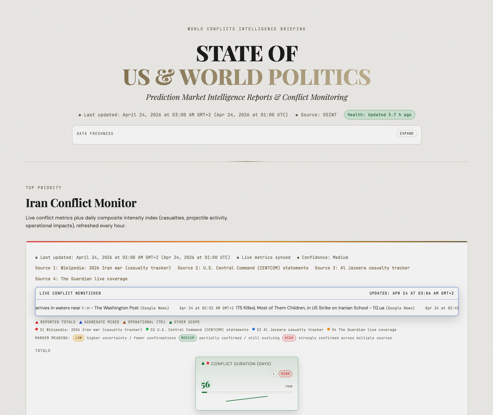
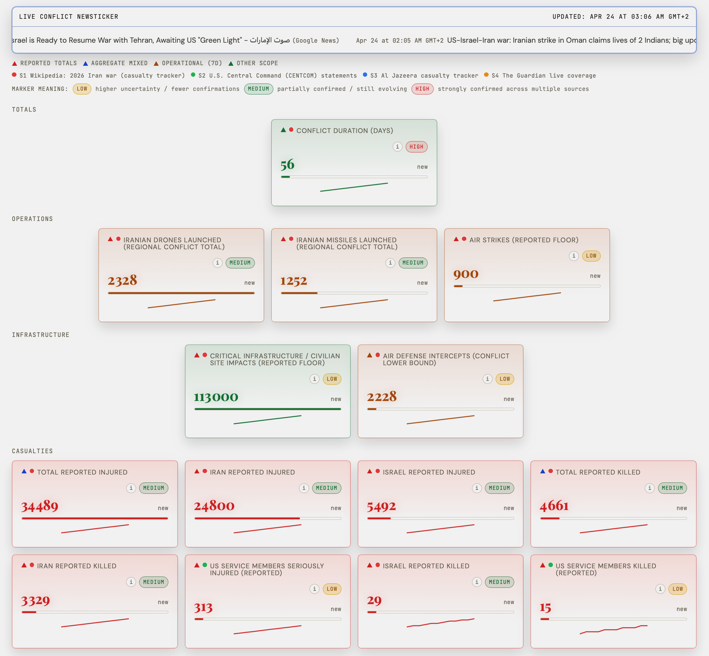
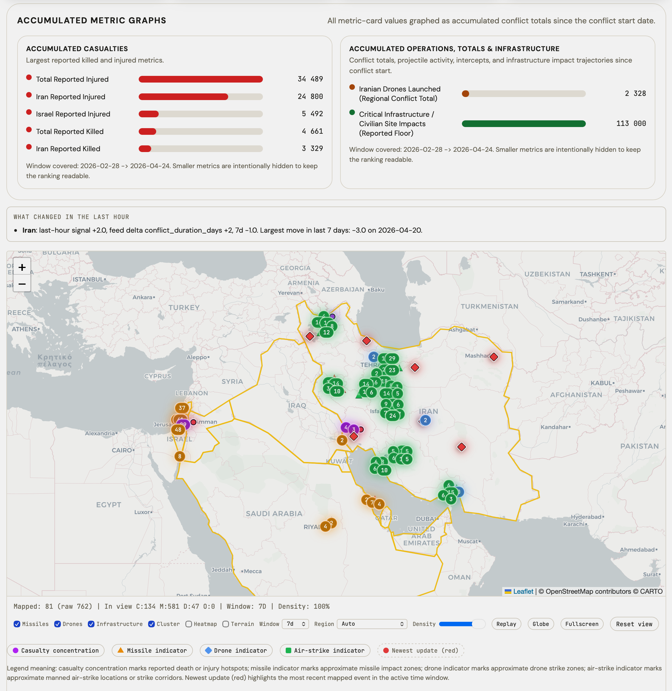

<p align="center">
  <a href="https://github.com/h3pdesign/appsh3p/commits/main"></a>
  <a href="https://apps-h3p.com"></a>
  <a href="https://apps-h3p.com/polymarket-us-politics/conflict-monitor.html"></a>
  <a href="https://apps-h3p.com"></a>
  <a href="https://vitepress.dev/"></a>
</p>

<h1 align="center">apps-h3p</h1>

<p align="center">
  <strong>Documentation hub and live operations portal</strong><br>
  A single VitePress-based repository for H3P app documentation and the public <code>STATE OF US &amp; WORLD POLITICS</code> monitor.
</p>

<p align="center">
  <a href="https://apps-h3p.com">apps-h3p.com</a> ·
  <a href="https://apps-h3p.com/polymarket-us-politics/conflict-monitor.html">Conflict Monitor</a> ·
  <a href="https://apps-h3p.com/polymarket-us-politics/state-of-us-politics.html">Predictions</a> ·
  <a href="https://apps-h3p.com/support">Support</a> ·
  <a href="https://apps-h3p.com/policies/privacy-policy">Policies</a>
</p>

<p align="center">
  <a href="https://apps-h3p.com"></a>
  <a href="https://www.patreon.com/h3p"></a>
  <a href="https://www.paypal.com/paypalme/HilthartPedersen"></a>
</p>

---

## What This Repo Contains

This repository powers two public surfaces from one codebase:

### 1. H3P Apps Documentation Hub

The app-management side of the project lives at [apps-h3p.com](https://apps-h3p.com).

It includes:

- overview pages for current H3P apps
- installation, FAQ, features, changelog, and component documentation
- support, legal, privacy, and cookie-policy pages
- app-specific media, icons, and release-linked documentation updates

### 2. STATE OF US & WORLD POLITICS

The monitor lives at [Conflict Monitor](https://apps-h3p.com/polymarket-us-politics/conflict-monitor.html) and [Predictions](https://apps-h3p.com/polymarket-us-politics/state-of-us-politics.html).

It includes:

- live conflict monitoring pages
- public prediction-market reporting pages
- automated metric refreshers
- map, timeline, and social-attention data pipelines
- GitHub Actions jobs that keep the public data payloads current

---

## Screenshots

### Apps Hub


### Conflict Cards and Live Ticker



### Conflict Monitor Overview



### Conflict Metrics and Map



---

## Quick Start

```bash
git clone https://github.com/h3pdesign/appsh3p.git
cd appsh3p
npm install
npm run docs:dev
```

Open [http://127.0.0.1:5173](http://127.0.0.1:5173).

Other useful commands:

```bash
npm run docs:build
npm run docs:preview
node scripts/validate-polymarket-site.mjs
node scripts/update-iran-war-metrics.mjs
node scripts/update-conflict-news.mjs
node scripts/update-market-id-map.mjs
node scripts/update-social-tracker-metrics.mjs
```

---

## Repository Structure

```text
docs/
  apps/                         App documentation pages
  policies/                     Privacy, cookie, terms, and trust pages
  public/
    icons/                      Public app icons
    media/                      Public screenshots and artwork
    polymarket-us-politics/     Conflict monitor and prediction portal
scripts/
  update-iran-war-metrics.mjs
  update-conflict-news.mjs
  update-market-id-map.mjs
  update-social-tracker-metrics.mjs
  validate-polymarket-site.mjs
.github/workflows/              Scheduled data refresh and deploy automation
```

---

## Data and Automation

The monitor side of the repo is not static markdown only. It also ships generated public data files under:

`docs/public/polymarket-us-politics/data/`

These payloads are refreshed by scheduled workflows for:

- conflict metrics and hotspot maps
- conflict news ticker data
- market ID mapping
- prediction snapshot data
- social attention metrics

The site is validated before publish with:

```bash
node scripts/validate-polymarket-site.mjs
```

---

## Deployment

The repository is configured for GitHub Pages on the custom domain:

- [https://apps-h3p.com](https://apps-h3p.com)

Relevant settings already exist in this repo:

- `docs/public/CNAME`
- VitePress config and sitemap hostname
- GitHub Actions workflows for scheduled updates and Pages deployment

Production build output:

```bash
docs/.vitepress/dist
```

---

## App Documentation Workflow

When adding or updating an app:

1. Create or update the app folder in `docs/apps/<slug>/`
2. Update app media in `docs/public/icons/` or `docs/public/media/`
3. Sync release-driven documentation if needed
4. Build locally
5. Validate and deploy

Typical local workflow:

```bash
npm run docs:build
node scripts/validate-polymarket-site.mjs
```

---

## Why This Repo Exists

This repository is the public-facing operations and documentation layer for:

- H3P app management and release communication
- conflict-monitoring presentation
- prediction-market reporting
- support, policy, and trust pages

The goal is one deployable site that serves product documentation, release communication, and continuously refreshed public intelligence pages from the same codebase.
