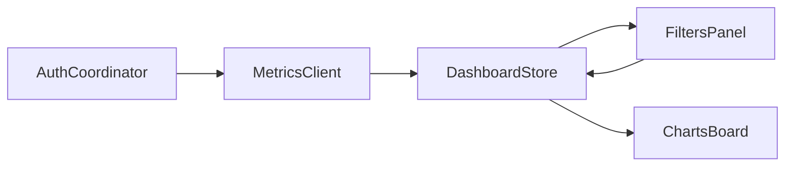

# Metrics Data Components Overview

## Design Philosophy

Metrics Data components are built around clarity of analytics flow: authenticate, fetch, aggregate, visualize.

## Core Components

- `AuthCoordinator`: OAuth + token lifecycle
- `MetricsClient`: API data fetch and validation
- `DashboardStore`: state shaping for chart views
- `FiltersPanel`: dimensions, date range, and account switching
- `ChartsBoard`: reusable Swift Charts rendering wrappers

## Data Flow



## Example Data Adapter

```swift
struct MetricsAdapter {
    func normalizedSeries(from points: [MetricPoint]) -> [ChartPoint] {
        points.map { ChartPoint(day: $0.date, value: $0.value) }
    }
}
```

## Related Pages

- [Overview](/apps/metric-data/overview)
- [Features](/apps/metric-data/features)
- [Code Examples](/apps/code-examples)
