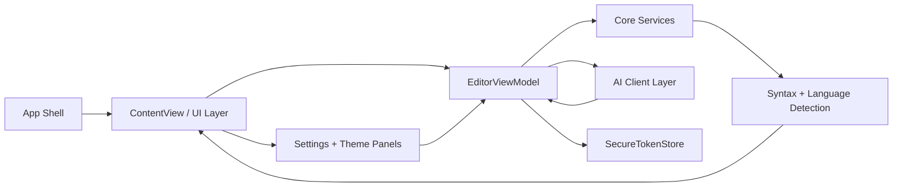

# Neon Vision Editor Components Overview

## Design Philosophy

Neon Vision Editor keeps components focused, composable, and native-first.  
Each UI unit should be fast to render, easy to reason about, and optional when possible.

_Source basis: GitHub repository structure and architecture notes for [`h3pdesign/Neon-Vision-Editor`](https://github.com/h3pdesign/Neon-Vision-Editor), main branch (latest push: February 19, 2026)._

## Component Layers

| Layer | Primary responsibility | Key paths |
|---|---|---|
| App Shell | App lifecycle, windows, scene composition | [`App/NeonVisionEditorApp.swift`](https://github.com/h3pdesign/Neon-Vision-Editor/blob/main/Neon%20Vision%20Editor/App/NeonVisionEditorApp.swift) |
| Core Services | Syntax, language detection, release policy, update flow | [`Core/`](https://github.com/h3pdesign/Neon-Vision-Editor/tree/main/Neon%20Vision%20Editor/Core) |
| Data + State | Editor state, secure token persistence, support flow state | [`Data/`](https://github.com/h3pdesign/Neon-Vision-Editor/tree/main/Neon%20Vision%20Editor/Data) |
| AI Integration | Provider/model clients for completion and AI features | [`AI/`](https://github.com/h3pdesign/Neon-Vision-Editor/tree/main/Neon%20Vision%20Editor/AI) |
| UI Composition | Editor views, toolbar, settings, sidebar, helper panels | [`UI/`](https://github.com/h3pdesign/Neon-Vision-Editor/tree/main/Neon%20Vision%20Editor/UI) |
| Domain Models | Shared model types crossing layers | [`Models/`](https://github.com/h3pdesign/Neon-Vision-Editor/tree/main/Neon%20Vision%20Editor/Models) |
| Assets + Privacy | App icons, asset catalogs, privacy manifest | [`Resources/`](https://github.com/h3pdesign/Neon-Vision-Editor/tree/main/Neon%20Vision%20Editor/Resources) |

## Detailed Components

### App Shell

- `NeonVisionEditorApp.swift`: root scene graph and entrypoint for app-level dependencies.
- Multi-window strategy uses scene/window composition (aligned with architecture notes).

### Core Services

- [`SyntaxHighlighting.swift`](https://github.com/h3pdesign/Neon-Vision-Editor/blob/main/Neon%20Vision%20Editor/Core/SyntaxHighlighting.swift): highlighting pipeline orchestration.
- [`LanguageDetector.swift`](https://github.com/h3pdesign/Neon-Vision-Editor/blob/main/Neon%20Vision%20Editor/Core/LanguageDetector.swift): language identification used by highlighting and editor hints.
- [`AppUpdateManager.swift`](https://github.com/h3pdesign/Neon-Vision-Editor/blob/main/Neon%20Vision%20Editor/Core/AppUpdateManager.swift): app update checks and update flow state.
- [`ReleaseRuntimePolicy.swift`](https://github.com/h3pdesign/Neon-Vision-Editor/blob/main/Neon%20Vision%20Editor/Core/ReleaseRuntimePolicy.swift): release/runtime gate logic.
- [`AppleFMHelper.swift`](https://github.com/h3pdesign/Neon-Vision-Editor/blob/main/Neon%20Vision%20Editor/Core/AppleFMHelper.swift): filesystem helper behavior around Apple platform specifics.

### Data + State

- [`EditorViewModel.swift`](https://github.com/h3pdesign/Neon-Vision-Editor/blob/main/Neon%20Vision%20Editor/Data/EditorViewModel.swift): central editor state, command orchestration, and document session coordination.
- [`SecureTokenStore.swift`](https://github.com/h3pdesign/Neon-Vision-Editor/blob/main/Neon%20Vision%20Editor/Data/SecureTokenStore.swift): secure credential/token storage (Keychain-backed in the project docs).
- [`SupportPurchaseManager.swift`](https://github.com/h3pdesign/Neon-Vision-Editor/blob/main/Neon%20Vision%20Editor/Data/SupportPurchaseManager.swift): optional support purchase state and flows.

### AI Integration

- [`AIClient.swift`](https://github.com/h3pdesign/Neon-Vision-Editor/blob/main/Neon%20Vision%20Editor/AI/AIClient.swift): high-level AI request interface.
- [`AIModelClient.swift`](https://github.com/h3pdesign/Neon-Vision-Editor/blob/main/Neon%20Vision%20Editor/AI/AIModelClient.swift): provider/model-specific request execution.
- [`AIModel.swift`](https://github.com/h3pdesign/Neon-Vision-Editor/blob/main/Neon%20Vision%20Editor/Models/AIModel.swift): model metadata and selection structure.

### UI Composition

- [`ContentView.swift`](https://github.com/h3pdesign/Neon-Vision-Editor/blob/main/Neon%20Vision%20Editor/UI/ContentView.swift): top-level workspace composition.
- [`ContentView+Toolbar.swift`](https://github.com/h3pdesign/Neon-Vision-Editor/blob/main/Neon%20Vision%20Editor/UI/ContentView%2BToolbar.swift): toolbar controls and command surfaces.
- [`ContentView+Actions.swift`](https://github.com/h3pdesign/Neon-Vision-Editor/blob/main/Neon%20Vision%20Editor/UI/ContentView%2BActions.swift): action routing and command wiring.
- [`EditorTextView.swift`](https://github.com/h3pdesign/Neon-Vision-Editor/blob/main/Neon%20Vision%20Editor/UI/EditorTextView.swift): text editing surface bridge.
- [`LineNumberRulerView.swift`](https://github.com/h3pdesign/Neon-Vision-Editor/blob/main/Neon%20Vision%20Editor/UI/LineNumberRulerView.swift): line ruler rendering.
- [`SidebarViews.swift`](https://github.com/h3pdesign/Neon-Vision-Editor/blob/main/Neon%20Vision%20Editor/UI/SidebarViews.swift): sidebar and navigation panes.
- [`NeonSettingsView.swift`](https://github.com/h3pdesign/Neon-Vision-Editor/blob/main/Neon%20Vision%20Editor/UI/NeonSettingsView.swift): settings composition.
- [`ThemeSettings.swift`](https://github.com/h3pdesign/Neon-Vision-Editor/blob/main/Neon%20Vision%20Editor/UI/ThemeSettings.swift): theme controls and mapping.
- [`PanelsAndHelpers.swift`](https://github.com/h3pdesign/Neon-Vision-Editor/blob/main/Neon%20Vision%20Editor/UI/PanelsAndHelpers.swift): supporting panels/helpers (including utility surfaces).
- [`GlassSurface.swift`](https://github.com/h3pdesign/Neon-Vision-Editor/blob/main/Neon%20Vision%20Editor/UI/GlassSurface.swift): reusable glass/visual surface primitive.
- [`ProjectFolderPicker.swift`](https://github.com/h3pdesign/Neon-Vision-Editor/blob/main/Neon%20Vision%20Editor/UI/ProjectFolderPicker.swift): project directory selection flow.
- [`AppUpdaterDialog.swift`](https://github.com/h3pdesign/Neon-Vision-Editor/blob/main/Neon%20Vision%20Editor/UI/AppUpdaterDialog.swift): update dialog UI.

## Component Interaction



## Runtime Data Flow

1. User input is captured in `EditorTextView`.
2. `EditorViewModel` updates the active document/session state.
3. Core services run detection/highlighting/update checks as needed.
4. UI components re-render from view model state snapshots.
5. Optional AI calls route through `AIClient` + `AIModelClient`.
6. Sensitive values (for supported features) resolve through `SecureTokenStore`.

## Performance-Critical Areas (Contributor Focus)

- Highlighting pipeline and its handoff back to visible editor ranges.
- Large file behavior and line-management paths (as called out in `ARCHITECTURE.md`).
- Multi-window state boundaries (avoid implicit global state coupling).
- Input interception/state-machine boundaries for keyboard-heavy workflows.

## Example Component Contract

```swift
protocol EditorPlugin {
    var id: String { get }
    func activate(in context: EditorContext)
    func deactivate()
}
```

## Recommended Extension Points

- New editor command: add action wiring in `ContentView+Actions.swift` and expose trigger in toolbar/palette.
- New syntax/language behavior: extend `LanguageDetector.swift` and `SyntaxHighlighting.swift`.
- New AI provider/model: extend `AIModel.swift`, then wire provider adapter through `AIModelClient.swift`.
- New settings pane: attach in `NeonSettingsView.swift`, persist via existing state/data services.

## Related Pages

- [Overview](/apps/neon-vision-editor/overview)
- [Features](/apps/neon-vision-editor/features)
- [Installation](/apps/neon-vision-editor/installation)
- [Changelog](/apps/neon-vision-editor/changelog)
- [Code Examples](/apps/code-examples)
