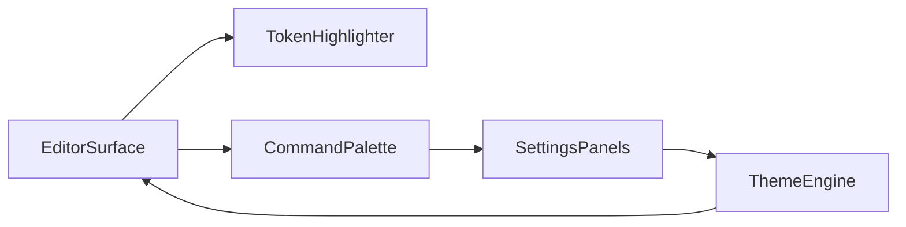

# Neon Vision Editor Components Overview

## Design Philosophy

Neon Vision Editor keeps components focused, composable, and native-first.  
Each UI unit should be fast to render, easy to reason about, and optional when possible.

## Core Components

- `EditorSurface`: text editing host with syntax rendering
- `TokenHighlighter`: incremental highlighting pipeline
- `CommandPalette`: command launcher and shortcuts
- `SettingsPanels`: grouped configuration sections
- `ThemeEngine`: app theme + token color mapping

## Component Interaction



## Example Component Contract

```swift
protocol EditorPlugin {
    var id: String { get }
    func activate(in context: EditorContext)
    func deactivate()
}
```

## Related Pages

- [Overview](/apps/neon-vision-editor/overview)
- [Features](/apps/neon-vision-editor/features)
- [Code Examples](/apps/code-examples)
