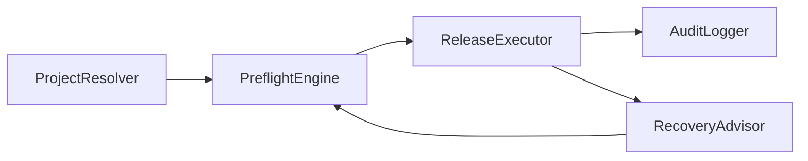

# Release Assistant Components Overview

## Design Philosophy

Release Assistant favors deterministic orchestration: every component should be auditable and explicit about failure states.

## Core Components

- `ProjectResolver`: detects active repository and release context
- `PreflightEngine`: validates workflow prerequisites
- `ReleaseExecutor`: launches guarded release modes
- `AuditLogger`: records command provenance and outcomes
- `RecoveryAdvisor`: remediation hints on failed steps

## Orchestration Flow



## Example Release Step

```bash
run_step "preflight" "scripts/ci/release_preflight.sh \"$VERSION\""
run_step "release" "scripts/release_all.sh \"$VERSION\""
```

## Related Pages

- [Overview](/apps/release-assistant/overview)
- [Features](/apps/release-assistant/features)
- [Code Examples](/apps/code-examples)
