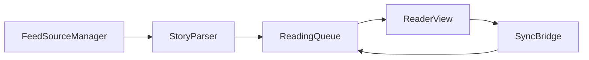

# X-Newsbook Components Overview

## Design Philosophy

X-Newsbook components prioritize calm reading flow: discover, open, save, and return without interface clutter.

## Core Components

- `FeedSourceManager`: curated source selection and ordering
- `StoryParser`: normalized article extraction pipeline
- `ReadingQueue`: saved and unread story management
- `ReaderView`: typography-first article surface
- `SyncBridge`: cross-device reading state sync

## Component Flow



## Example Reader Model

```swift
struct StoryPreview: Identifiable {
    let id: UUID
    let title: String
    let source: String
    let publishedAt: Date
    var isSaved: Bool
}
```

## Related Pages

- [Overview](/apps/x-newsbook/overview)
- [Features](/apps/x-newsbook/features)
- [Code Examples](/apps/code-examples)
